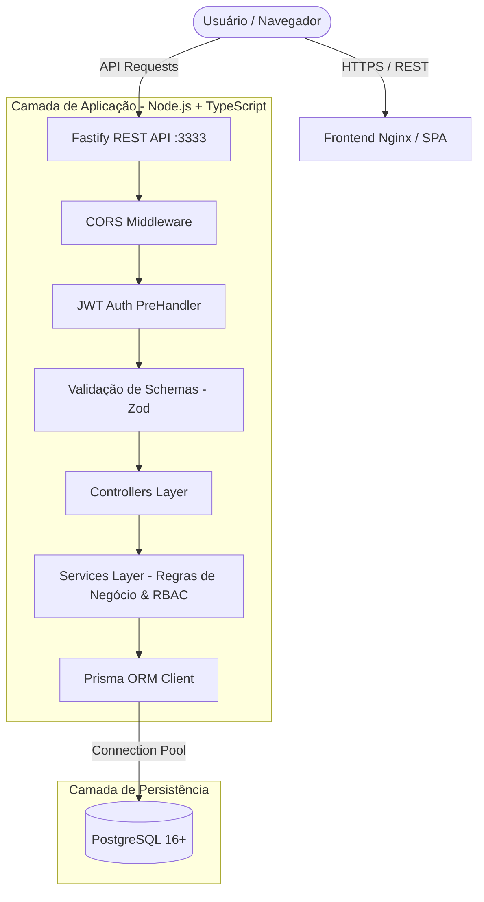
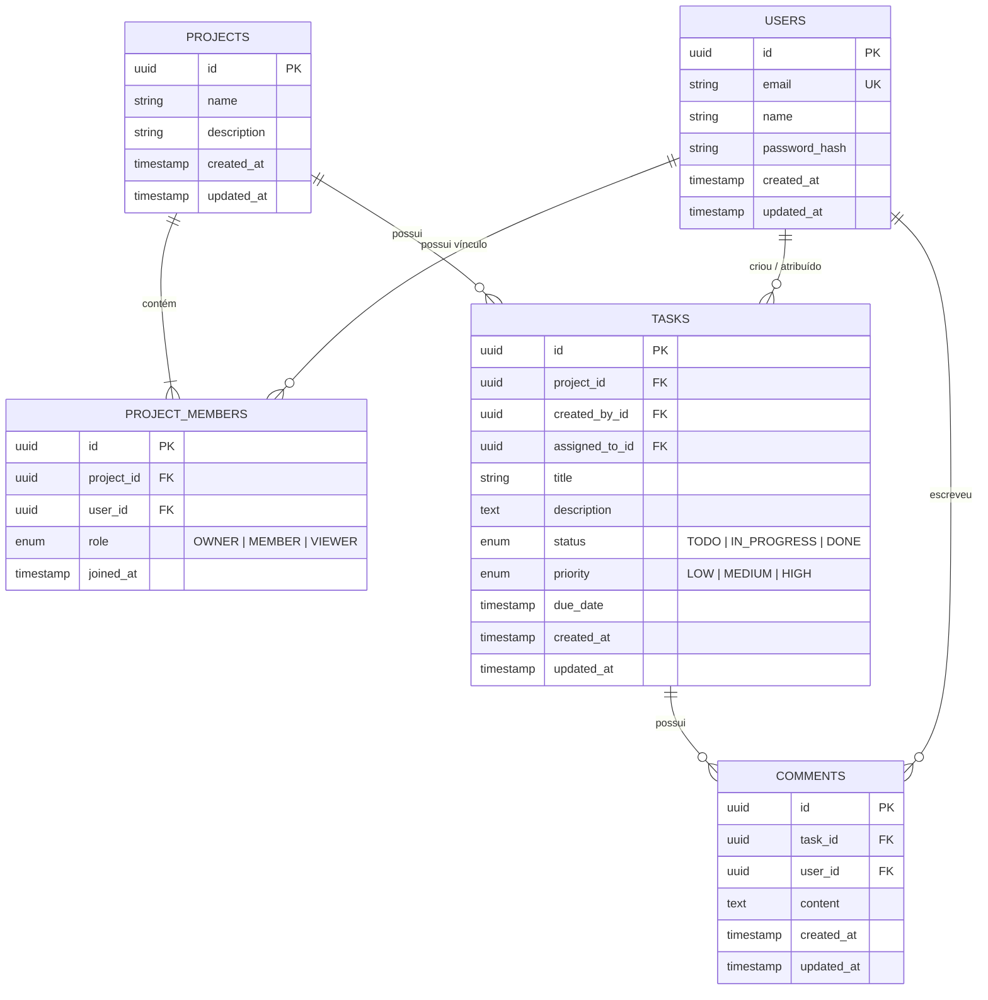
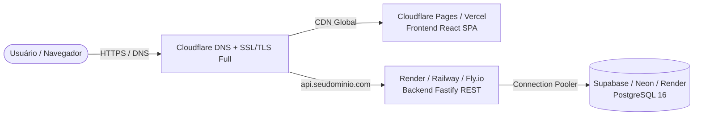

# 🚀 Project Management System (PMS)

<div align="center">

[](https://github.com/gabrielLemke/ProjectManagementSystem/actions/workflows/ci.yml)
[](https://nodejs.org/)
[](https://www.typescriptlang.org/)
[](https://fastify.dev/)
[](https://react.dev/)
[](https://www.prisma.io/)
[](https://www.postgresql.org/)
[](https://www.docker.com/)

**Plataforma Full Stack completa para gerenciamento ágil de projetos, equipes e tarefas (Kanban).**  
Construída com foco em boas práticas de engenharia de software, tipagem estrita de ponta a ponta, controle de acesso baseado em papéis (RBAC), testes de integração reais e esteira de CI/CD automatizada.

[Visão Geral](#-visão-geral) • [Destaques Técnicos](#-destaques-técnicos-para-avaliadores) • [Arquitetura](#-arquitetura-do-sistema) • [Modelagem (DER)](#-modelagem-de-dados-der) • [Instalação](#-guia-de-instalação-e-execução) • [API](#-documentação-das-rotas-da-api) • [Testes](#-suíte-de-testes-automatizados) • [Deploy](#-devops-cicd--deploy-em-produção)

</div>

---

## 📌 Visão Geral

O **Project Management System (PMS)** é uma aplicação web desenvolvida para simular cenários reais de produtos SaaS modernos (como Jira, Linear e GitHub Projects). O objetivo principal não é apenas entregar um CRUD, mas demonstrar domínio prático sobre decisões arquiteturais, segurança, consistência de dados, containerização e automação de testes.

### Principais Funcionalidades
- 🔐 **Autenticação Segura**: Cadastro e login com hashing de senhas via `bcryptjs` (10 rounds) e emissão de JWT com expiração configurada.
- 👥 **Controle de Acesso RBAC**: Papéis de usuário em nível de projeto (`OWNER`, `MEMBER`, `VIEWER`), impedindo acessos indevidos no backend.
- 📁 **Gestão de Projetos**: Criação atômica com transações (`$transaction`), listagem paginada, filtros em tempo real e exclusão em cascata.
- 📋 **Board Kanban & Tarefas**: Criação, priorização (`LOW`, `MEDIUM`, `HIGH`), atribuição de responsáveis e movimentação entre status (`A Fazer`, `Em Andamento`, `Concluído`).
- 💬 **Comentários Colaborativos**: Histórico de discussões dentro de cada tarefa em ordem cronológica.
- 📊 **Dashboard Métrico**: Indicadores de tarefas concluídas, ativas e atrasadas com saudação dinâmica.
- 🎨 **Interface Moderna**: SPA desenvolvida com React + Tailwind CSS com tema escuro (Dark Mode) refinado e design responsivo.

---

## 💡 Destaques Técnicos para Avaliadores

> [!NOTE]
> **Por que este projeto se destaca em avaliações técnicas de nível pleno/sênior?**

1. **Autorização Real no Backend (RBAC)**: A segurança não é cosmética. Regras de permissão (quem pode editar, quem pode convidar membros, quem só pode visualizar) são aplicadas na camada de serviço e validadas no banco de dados, e não apenas ocultando botões na interface.
2. **Consistência Transacional**: Criações de projetos utilizam transações interativas do Prisma (`$transaction`) para garantir que o projeto e o vínculo de `OWNER` do criador sejam persistidos juntos atomicamente.
3. **25 Testes de Integração com Banco Real**: A suíte de testes não usa mocks vazios. Ela roda contra uma instância real de PostgreSQL, validando códigos HTTP, violações de integridade, mensagens de erro e comportamentos de borda.
4. **Pipeline de CI com Service Container**: No GitHub Actions, cada PR ou push sobe um container oficial do PostgreSQL, roda as migrations do Prisma, compila o TypeScript e executa todos os 25 testes antes de autorizar o merge.
5. **Docker Multi-Stage & Segurança**: Imagens de produção que descartam compiladores e ferramentas de build, instalando apenas dependências de produção e rodando como usuário não-root (`USER node`). O Frontend é servido via **Nginx** de alta performance com Gzip e cabeçalhos de proteção HTTP.
6. **Prevenção contra Enumeração de Usuários**: Mensagens de erro de login unificadas para e-mails inexistentes e senhas incorretas, protegendo a privacidade dos usuários.

---

## 🏗 Arquitetura do Sistema



---

## 🗄 Modelagem de Dados (DER)



---

## 🛠 Stack Tecnológica e Decisões

| Camada | Tecnologia | Decisão Técnica & Trade-offs |
| :--- | :--- | :--- |
| **Backend** | Node.js (v22+) + Fastify | Desenvolvido com suporte nativo a TypeScript, arquitetura de plugins modular e latência significativamente inferior ao Express clássico. |
| **Linguagem** | TypeScript 5.x | Configurado em modo estrito (`strict: true`, `NodeNext`) em todo o projeto (backend e frontend), eliminando erros em tempo de execução. |
| **Validação** | Zod | Validação de contratos na camada de entrada da API. Garante tipagem estrita inferida (`z.infer`) e formata erros 400 amigáveis. |
| **ORM & Banco** | Prisma + PostgreSQL 16 | Schema declarativo legível, migrations versionadas, integridade referencial com ações em cascata (`CASCADE`, `SET NULL`, `RESTRICT`) e tipagem automática. |
| **Frontend** | React 18 + Vite | SPA ultrarrápida com Hot Module Replacement instantâneo, empacotamento otimizado e carregamento sob demanda. |
| **Estilização** | Tailwind CSS + Lucide Icons | Estilização utilitária moderna com zero CSS não utilizado no bundle de produção. |
| **Testes** | Node Test Runner + Fastify Inject | Testes de integração ultrarrápidos executados em memória sem precisar abrir portas TCP locais. |
| **DevOps** | Docker, Nginx & GitHub Actions | Imagens multi-stage para backend e frontend, pipeline de CI automatizada com PostgreSQL em service container. |

---

## 📂 Estrutura do Repositório

```text
ProjectManagementSystem/
├── .github/
│   └── workflows/
│       └── ci.yml                 # Pipeline de CI (Lint, Typecheck, Migrations e 25 Testes)
├── backend/                      # API REST em Fastify + TypeScript + Prisma
│   ├── Dockerfile                 # Multi-stage build Node.js 22 Alpine (non-root user)
│   ├── .dockerignore
│   ├── prisma/
│   │   ├── schema.prisma          # Modelagem declarativa do banco de dados
│   │   └── migrations/            # Histórico de migrations SQL versionadas
│   ├── src/
│   │   ├── app.ts                 # Fábrica Fastify, CORS, JWT e Error Handler global
│   │   ├── server.ts              # Ponto de entrada com Graceful Shutdown (SIGINT/SIGTERM)
│   │   ├── controllers/           # Manipuladores de requisição HTTP (Auth, Projects, Tasks)
│   │   ├── services/              # Casos de uso de negócio e regras de RBAC
│   │   ├── schemas/               # Schemas de validação estrita com Zod
│   │   ├── middlewares/           # PreHandler de autenticação Bearer JWT
│   │   ├── errors/                # Classe base de erros semânticos de domínio
│   │   └── lib/                   # Singletons (Prisma Client com pool de conexões)
│   └── tests/                     # 25 Testes de integração automatizados
│       ├── auth.test.ts           # Testes de autenticação, JWT e validações
│       ├── projects.test.ts       # Testes de projetos, membresia e RBAC
│       └── tasks.test.ts          # Testes de Kanban, filtros, status e comentários
├── frontend/                     # SPA em React 18 + TypeScript + Vite + Tailwind
│   ├── Dockerfile                 # Multi-stage build gerando Nginx Alpine otimizado
│   ├── nginx.conf                 # Roteamento SPA, Gzip compression e Security Headers
│   ├── .dockerignore
│   ├── src/
│   │   ├── contexts/              # AuthContext (sessão e persistência em localStorage)
│   │   ├── components/            # Sidebar, TopBar, modais e componentes de layout
│   │   ├── pages/                 # AuthPage, DashboardPage e ProjectsPage (Kanban completo)
│   │   ├── lib/                   # Cliente HTTP (fetch wrapper) e formatadores
│   │   └── types/                 # Tipos TypeScript compartilhados com a API
├── docker-compose.yml             # Orquestração para desenvolvimento local
├── docker-compose.prod.yml        # Orquestração da pilha de produção (Postgres + API + Nginx)
├── .env.example                  # Modelo de variáveis de ambiente
└── README.md                      # Documentação técnica completa
```

---

## ⚡ Guia de Instalação e Execução

### Pré-requisitos
- [Node.js](https://nodejs.org/) v20+ ou superior (Recomendado v22 LTS)
- [Git](https://git-scm.com/)
- [PostgreSQL](https://www.postgresql.org/) local ou [Docker](https://www.docker.com/)

### 1. Clonar o Repositório
```bash
git clone https://github.com/gabrielLemke/ProjectManagementSystem.git
cd ProjectManagementSystem
```

### 2. Configurar Variáveis de Ambiente
Copie os modelos de ambiente:
```bash
cp .env.example .env
cp backend/.env.example backend/.env
```
*(Certifique-se de que a `DATABASE_URL` no `.env` aponte para o seu PostgreSQL local).*

### 3. Iniciar o Banco de Dados (PostgreSQL via Docker)
```bash
docker compose up -d
```

### 4. Instalar Dependências e Executar Migrations
```bash
# No diretório raiz:
cd backend
npm install
npx prisma migrate dev
```

### 5. Iniciar o Backend
```bash
npm run dev
```
> A API Fastify estará escutando em: `http://localhost:3333`  
> Verificação de integridade: `http://localhost:3333/health`

### 6. Iniciar o Frontend
Em outro terminal:
```bash
cd frontend
npm install
npm run dev
```
> A aplicação React estará acessível em: `http://localhost:5173`

---

## 🐳 Execução em Produção via Docker Compose

Para simular o ambiente de produção completo (PostgreSQL + Backend Node compilado + Frontend Nginx com Gzip na porta 80):

```bash
docker compose -f docker-compose.prod.yml up --build -d
```
Acesse:
- **Aplicação Web**: `http://localhost` (Porta 80)
- **API REST**: `http://localhost:3333`

---

## 📖 Documentação das Rotas da API

### Módulo de Autenticação (`/api/v1/auth`)

| Método | Endpoint | Protegido? | Descrição |
| :--- | :--- | :---: | :--- |
| `GET` | `/health` | Não | Retorna status de saúde e tempo de atividade da API. |
| `POST` | `/api/v1/auth/register` | Não | Cadastra um novo usuário com senha criptografada via Bcrypt. |
| `POST` | `/api/v1/auth/login` | Não | Autentica as credenciais e emite o token JWT (7 dias). |
| `GET` | `/api/v1/auth/me` | **Sim (Bearer)** | Retorna o perfil completo do usuário autenticado no token. |

### Módulo de Projetos e Membros (`/api/v1/projects`)

| Método | Endpoint | Protegido? | Permissão (RBAC) | Descrição |
| :--- | :--- | :---: | :---: | :--- |
| `POST` | `/api/v1/projects` | **Sim (Bearer)** | Autenticado | Cria projeto via `$transaction` e define criador como `OWNER`. |
| `GET` | `/api/v1/projects` | **Sim (Bearer)** | Membro | Lista projetos onde o usuário é membro, com paginação e busca. |
| `GET` | `/api/v1/projects/:id` | **Sim (Bearer)** | Membro | Retorna detalhes do projeto, membros e métricas de tarefas. |
| `PATCH` | `/api/v1/projects/:id` | **Sim (Bearer)** | `OWNER` | Atualiza nome e descrição do projeto. |
| `DELETE` | `/api/v1/projects/:id` | **Sim (Bearer)** | `OWNER` | Exclui o projeto e recursos vinculados em cascata. |
| `POST` | `/api/v1/projects/:id/members` | **Sim (Bearer)** | `OWNER` | Adiciona um usuário ao projeto com papel `MEMBER` ou `VIEWER`. |
| `DELETE` | `/api/v1/projects/:id/members/:memberId` | **Sim (Bearer)** | `OWNER` | Remove um membro do projeto (bloqueia auto-remoção do `OWNER`). |

### Módulo de Tarefas e Comentários (`/api/v1/projects/:id/tasks`)

| Método | Endpoint | Protegido? | Permissão (RBAC) | Descrição |
| :--- | :--- | :---: | :---: | :--- |
| `GET` | `/api/v1/projects/:id/tasks` | **Sim (Bearer)** | Membro | Lista tarefas paginadas; aceita filtros `status`, `priority` e `assigned_to`. |
| `POST` | `/api/v1/projects/:id/tasks` | **Sim (Bearer)** | `OWNER`, `MEMBER` | Cria tarefa (título, descrição, prioridade, status, responsável e prazo). |
| `PATCH` | `/api/v1/projects/:id/tasks/:taskId` | **Sim (Bearer)** | `OWNER`, `MEMBER` | Atualiza o status da tarefa (movimentação no Kanban). |
| `GET` | `/api/v1/projects/:id/tasks/:taskId/comments` | **Sim (Bearer)** | Membro | Lista comentários em ordem cronológica de publicação. |
| `POST` | `/api/v1/projects/:id/tasks/:taskId/comments` | **Sim (Bearer)** | `OWNER`, `MEMBER` | Publica um comentário na tarefa. |

---

## 🧪 Suíte de Testes Automatizados

O projeto utiliza o executor de testes nativo do Node.js (`tsx --test`) com **testes de integração reais** contra o PostgreSQL (sem mocks de banco):

```bash
cd backend
npm test
```

### Detalhamento dos 25 Testes:
```text
▶ Módulo de Autenticação (Testes de Integração)
  ✔ deve registrar um novo usuário com sucesso (POST /api/v1/auth/register)
  ✔ deve rejeitar registro com e-mail duplicado retornando 409
  ✔ deve rejeitar payload inválido retornando 400 com detalhes do Zod
  ✔ deve autenticar o usuário com credenciais corretas e retornar o JWT
  ✔ deve rejeitar login com senha incorreta retornando 401
  ✔ deve rejeitar acesso à rota protegida sem token
  ✔ deve retornar os dados do perfil do usuário autenticado

▶ Módulo de Projetos e Membros (Testes de Integração & RBAC)
  ✔ deve criar um projeto com sucesso e atribuir o criador como OWNER
  ✔ deve listar os projetos do usuário com paginação
  ✔ deve obter os detalhes do projeto se o usuário for membro
  ✔ deve negar acesso ao projeto para um usuário não membro retornando 403
  ✔ deve permitir que o OWNER adicione um novo membro ao projeto
  ✔ deve rejeitar adicionar o mesmo membro duas vezes retornando 409
  ✔ deve impedir que um MEMBER tente adicionar novos membros retornando 403
  ✔ deve permitir que o OWNER atualize os dados do projeto
  ✔ deve impedir que um MEMBER atualize os dados do projeto retornando 403
  ✔ deve impedir que o OWNER remova a si próprio do projeto retornando 400
  ✔ deve permitir que o OWNER remova um membro
  ✔ deve permitir que o OWNER exclua o projeto

▶ Módulo de Tarefas e Comentários (Testes de Integração & Kanban)
  ✔ deve permitir que o OWNER crie uma nova tarefa
  ✔ deve impedir que um VIEWER crie tarefas retornando 403
  ✔ deve permitir listar tarefas do projeto com filtros
  ✔ deve permitir que o OWNER atualize o status da tarefa
  ✔ deve permitir adicionar comentário em uma tarefa
  ✔ deve listar os comentários de uma tarefa

ℹ tests 25 | suites 3 | pass 25 | fail 0 (2.4s)
```

---

## 🚀 DevOps, CI/CD & Deploy em Produção

### 1. Integração Contínua (GitHub Actions)
A esteira automatizada em [.github/workflows/ci.yml](file:///.github/workflows/ci.yml) executa a cada push ou PR:
- Inicializa um PostgreSQL 16 oficial em service container.
- Executa migrations, checagem estrita de tipos e os 25 testes de integração.
- Compila o bundle estático do frontend com o Vite.

### 2. Arquitetura de Deploy em Nuvem (Free Tier) & Cloudflare



#### Guia de Publicação:
1. **Banco de Dados**: Crie uma instância PostgreSQL gratuita no [Supabase](https://supabase.com/) ou [Neon](https://neon.tech/) e obtenha a `DATABASE_URL`.
2. **Backend**: Crie um Web Service no [Render](https://render.com/) ou [Railway](https://railway.app/) apontando para `/backend`. Configure as variáveis `DATABASE_URL`, `JWT_SECRET` e `CORS_ORIGIN`.
3. **Frontend**: Conecte o repositório ao [Cloudflare Pages](https://pages.cloudflare.com/) apontando para o diretório `/frontend` com comando `npm run build` e pasta de saída `dist`. Defina `VITE_API_URL=https://api.seudominio.com`.
4. **Cloudflare & Domínio**: Configure os registros CNAME (`@` para o Pages e `api` para a API) e ative o SSL/TLS **Full (Strict)**.

---

## 👤 Autor

Desenvolvido por **Gabriel Henrique Lemke**.

- **LinkedIn**: [linkedin.com/in/gabriel-henrique-lemke-987580214](https://www.linkedin.com/in/gabriel-henrique-lemke-987580214/)
- **E-mail**: [gabriel.henrique.lemke@gmail.com](mailto:gabriel.henrique.lemke@gmail.com)
- **GitHub**: [@gabrielLemke](https://github.com/gabrielLemke)
- **Repositório**: [ProjectManagementSystem](https://github.com/gabrielLemke/ProjectManagementSystem)

---

## 📄 Licença

Este projeto está sob a licença [MIT](LICENSE).
