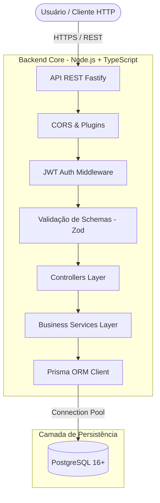
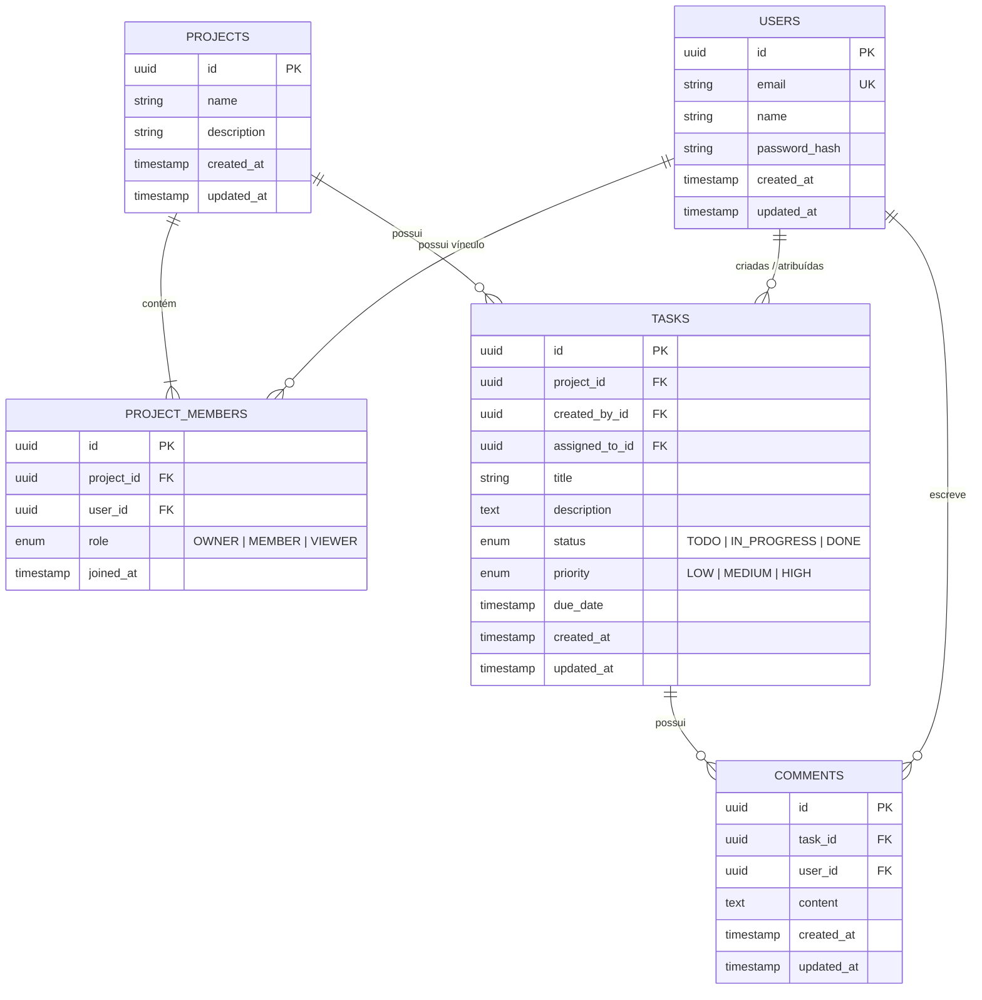
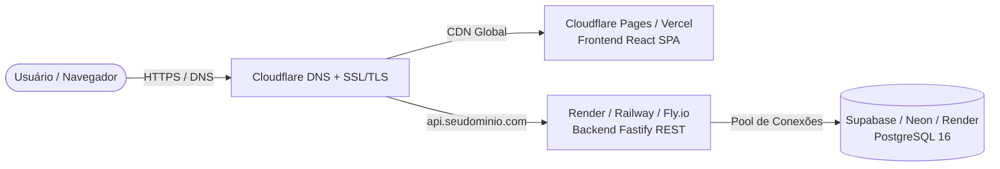

# 🚀 Project Management System (PMS)

[](https://nodejs.org/)
[](https://www.typescriptlang.org/)
[](https://fastify.dev/)
[](https://www.prisma.io/)
[](https://www.postgresql.org/)
[](https://www.docker.com/)

Uma plataforma robusta e escalável de gerenciamento de projetos desenvolvida com arquitetura limpa, tipagem estrita de ponta a ponta e foco em padrões modernos de engenharia de software para ambiente de produção.

---

## 📌 Sumário
- [Arquitetura do Sistema](#-arquitetura-do-sistema)
- [Modelagem de Dados (DER)](#-modelagem-de-dados-der)
- [Stack Tecnológica e Decisões](#-stack-tecnológica-e-decisões)
- [Estrutura do Repositório](#-estrutura-do-repositório)
- [Guia de Instalação e Execução](#-guia-de-instalação-e-execução)
- [Documentação das Rotas da API](#-documentação-das-rotas-da-api)
- [Padrões de Segurança & Tratamento de Erros](#-padrões-de-segurança--tratamento-de-erros)
- [Suíte de Testes Automatizados](#-suíte-de-testes-automatizados)
- [Roadmap de Desenvolvimento](#-roadmap-de-desenvolvimento)

---

## 🏗 Arquitetura do Sistema



---

## 🗄 Modelagem de Dados (DER)



---

## 🛠 Stack Tecnológica e Decisões

| Tecnologia | Função | Motivo da Escolha (Trade-off) |
| :--- | :--- | :--- |
| **Node.js (v22+) + TypeScript** | Ambiente & Tipagem | Tipagem estrita com modo `NodeNext` para capturar erros em tempo de compilação. |
| **Fastify** | Framework HTTP REST | Desenvolvido com suporte nativo a TS, ecossistema de plugins modular e latência significativamente menor que o Express. |
| **Prisma ORM** | Mapeamento Objeto-Relacional | Schema declarativo legível, migrations versionadas e cliente gerado com 100% de inferência de tipos. |
| **PostgreSQL** | Banco de Dados Relacional | Suporte a constraints avançadas, índices compostos e integridade referencial com ações em cascata (`CASCADE`, `SET NULL`). |
| **Zod** | Validação de Dados | Validação estrita de contratos de entrada na camada de borda da API. |
| **Bcrypt.js + @fastify/jwt** | Segurança & Sessões | Hashing de senhas seguro (10 rounds) e autenticação *stateless* baseada em Bearer Tokens. |
| **Node Test Runner + Fastify Inject** | Testes Automatizados | Testes de integração rápidos e sem dependências pesadas, testando requisições em memória sem ocupar portas TCP. |

---

## 📂 Estrutura do Repositório

```text
ProjectManagementSystem/
├── .github/                      # Workflows de CI/CD (GitHub Actions)
├── backend/                      # API REST
│   ├── prisma/                   # Schema e migrations SQL versionadas
│   ├── src/
│   │   ├── app.ts                # Fábrica da aplicação Fastify, plugins e error handler
│   │   ├── server.ts             # Ponto de entrada com Graceful Shutdown
│   │   ├── controllers/          # Manipuladores de requisição/resposta HTTP
│   │   ├── services/             # Regras de negócio e casos de uso
│   │   ├── schemas/              # Schemas de validação de entrada (Zod)
│   │   ├── middlewares/          # Guards de autenticação e RBAC
│   │   ├── errors/               # Classes de erros de domínio da aplicação
│   │   └── lib/                  # Singletons de infraestrutura (Prisma Client)
│   └── tests/                    # Suíte de testes de integração automatizados
├── frontend/                     # Aplicação SPA em React + TypeScript (Fase 4)
├── docker-compose.yml            # Orquestração do banco PostgreSQL para desenvolvimento
└── .env.example                  # Template com variáveis de ambiente do projeto
```

---

## ⚡ Guia de Instalação e Execução

### Pré-requisitos
- **Node.js** (v20+)
- **Git**
- **PostgreSQL** (ou **Docker & Docker Compose**)

### 1. Clonar o projeto
```bash
git clone https://github.com/gabrielLemke/ProjectManagementSystem.git
cd ProjectManagementSystem
```

### 2. Configurar Variáveis de Ambiente
Copie o arquivo de exemplo para `.env`:
```bash
cp .env.example .env
```
Preencha a `DATABASE_URL` no `.env` e no `backend/.env`.

### 3. Iniciar o Banco de Dados (Via Docker)
```bash
docker compose up -d
```
*(Se estiver utilizando um PostgreSQL local, certifique-se de que a porta 5432 esteja acessível).*

### 4. Instalar Dependências e Rodar as Migrations
```bash
cd backend
npm install
npx prisma migrate dev
```

### 5. Iniciar o Servidor de Desenvolvimento
```bash
npm run dev
```
A API iniciará em: `http://localhost:3333`

---

## 📖 Documentação das Rotas da API

### Módulo de Autenticação (`/api/v1/auth`)

| Método | Endpoint | Protegido? | Descrição |
| :--- | :--- | :---: | :--- |
| `GET` | `/health` | Não | Retorna o status de integridade e tempo de atividade da API. |
| `POST` | `/api/v1/auth/register` | Não | Cadastra um novo usuário com senha criptografada. |
| `POST` | `/api/v1/auth/login` | Não | Autentica o usuário e emite o token JWT (7 dias). |
| `GET` | `/api/v1/auth/me` | **Sim (Bearer)** | Retorna o perfil completo do usuário autenticado. |

### Módulo de Projetos e Membros (`/api/v1/projects`)

| Método | Endpoint | Protegido? | Permissão (RBAC) | Descrição |
| :--- | :--- | :---: | :---: | :--- |
| `POST` | `/api/v1/projects` | **Sim (Bearer)** | Autenticado | Cria um novo projeto e define o usuário como `OWNER`. |
| `GET` | `/api/v1/projects` | **Sim (Bearer)** | Membro | Lista projetos onde o usuário é membro, com paginação e busca. |
| `GET` | `/api/v1/projects/:id` | **Sim (Bearer)** | Membro | Retorna detalhes do projeto, membros e contadores. |
| `PATCH` | `/api/v1/projects/:id` | **Sim (Bearer)** | `OWNER` | Atualiza nome e descrição do projeto. |
| `DELETE` | `/api/v1/projects/:id` | **Sim (Bearer)** | `OWNER` | Exclui o projeto e recursos vinculados em cascata. |
| `POST` | `/api/v1/projects/:id/members` | **Sim (Bearer)** | `OWNER` | Adiciona um usuário ao projeto com papel `MEMBER` ou `VIEWER`. |
| `DELETE` | `/api/v1/projects/:id/members/:memberId` | **Sim (Bearer)** | `OWNER` | Remove um membro do projeto (impede auto-remoção do OWNER). |
| `GET` | `/api/v1/projects/:id/tasks` | **Sim (Bearer)** | Membro | Lista tarefas paginadas; aceita filtros combináveis `status`, `priority` e `assigned_to`. |
| `POST` | `/api/v1/projects/:id/tasks` | **Sim (Bearer)** | `OWNER`, `MEMBER` | Cria tarefa com título, descrição, prioridade, status, responsável e prazo. O responsável precisa ser membro do projeto. |
| `PATCH` | `/api/v1/projects/:id/tasks/:taskId` | **Sim (Bearer)** | `OWNER`, `MEMBER` | Move a tarefa alterando seu `status`. |
| `GET` | `/api/v1/projects/:id/tasks/:taskId/comments` | **Sim (Bearer)** | Membro | Lista comentários em ordem de publicação, com autor e data. |
| `POST` | `/api/v1/projects/:id/tasks/:taskId/comments` | **Sim (Bearer)** | `OWNER`, `MEMBER` | Publica um comentário na tarefa. |

Os filtros de tarefas aceitam `status=TODO|IN_PROGRESS|DONE`, `priority=LOW|MEDIUM|HIGH` e `assigned_to=<userId>`, além de `page` e `limit`. Membros com papel `VIEWER` podem consultar tarefas e comentários, mas não criar tarefas, movê-las ou publicar comentários.

---

## 🛡 Padrões de Segurança & Tratamento de Erros

1. **Prevenção contra Enumeração de Usuários**: Mensagens de erro de login genéricas (`"E-mail ou senha inválidos."`) para não expor a existência de contas.
2. **Proteção de Dados Sensíveis**: As consultas no banco via Prisma utilizam `select` explícito, garantindo que o `password_hash` nunca trafegue nas respostas HTTP.
3. **Respostas Padronizadas de Erro**:
   - Erros do Zod (400): retornam os campos exatos e mensagens amigáveis de validação.
   - Erros de Conflito (409): informam unicidade de recursos (ex: e-mail já cadastrado).
   - Erros de Autenticação (401): barram acessos não autorizados antes de atingir os serviços.
4. **Graceful Shutdown**: Tratamento de sinais do sistema (`SIGINT`, `SIGTERM`) para encerramento limpo das conexões de rede ativas.

---

## 🧪 Suíte de Testes Automatizados

O projeto utiliza o executor de testes nativo do Node.js (`tsx --test`) com testes de integração reais contra o banco de dados:

```bash
cd backend
npm test
```

Testes inclusos (25 testes de integração com banco de dados real):
- **Autenticação (7 testes)**:
  - ✅ Criação de usuário com hash seguro (bcrypt 10 rounds) (201)
  - ✅ Rejeição de cadastro com e-mail duplicado (409)
  - ✅ Validação estrita de payload via Zod (400)
  - ✅ Autenticação com credenciais válidas e emissão de JWT (200)
  - ✅ Rejeição de login com senha incorreta (401)
  - ✅ Bloqueio de rota protegida sem token (401)
  - ✅ Retorno de perfil para token válido (200)
- **Projetos e Membros / RBAC (12 testes)**:
  - ✅ Criação atômica de projeto via transaction atribuindo criador como `OWNER` (201)
  - ✅ Listagem paginada apenas dos projetos onde o usuário é membro (200)
  - ✅ Consulta detalhada de projeto para membros (200)
  - ✅ Bloqueio de acesso para usuários não membros (403)
  - ✅ Adição de membro via e-mail pelo `OWNER` (201)
  - ✅ Bloqueio de membro duplicado (409)
  - ✅ Bloqueio de adição de membro por não-proprietário (403)
  - ✅ Atualização de dados do projeto pelo `OWNER` (200)
  - ✅ Bloqueio de edição por membros comuns (403)
  - ✅ Bloqueio de auto-remoção do `OWNER` (400)
  - ✅ Remoção de membro pelo `OWNER` (200)
  - ✅ Exclusão de projeto em cascata pelo `OWNER` (200)
- **Tarefas e Comentários / Kanban (6 testes)**:
  - ✅ Criação de tarefa vinculada ao projeto pelo `OWNER` (201)
  - ✅ Bloqueio de criação de tarefas por `VIEWER` (403)
  - ✅ Listagem de tarefas com filtros por status e prioridade (200)
  - ✅ Atualização de status da tarefa / movimentação no Kanban (200)
  - ✅ Publicação de comentário em tarefa (201)
  - ✅ Listagem de comentários em ordem cronológica (200)

---

## 🚀 DevOps, CI/CD & Deploy em Produção

### 1. Integração Contínua (GitHub Actions)
O repositório possui uma pipeline automatizada ([.github/workflows/ci.yml](file:///.github/workflows/ci.yml)) executada a cada `push` ou `pull request` para a branch `main`:
- **Backend Job**:
  - Inicializa um container de serviço real com PostgreSQL 16 Alpine.
  - Executa as migrations do Prisma (`npx prisma migrate deploy`).
  - Valida tipagens estritas via TypeScript (`npx tsc --noEmit`).
  - Executa a suíte de 25 testes de integração reais contra o banco de dados.
- **Frontend Job**:
  - Valida tipagens do TypeScript.
  - Executa o build de produção com Vite, gerando o bundle otimizado.

### 2. Dockerização Multi-Stage
A aplicação possui Dockerfiles otimizados com múltiplos estágios (*multi-stage builds*) para reduzir a superfície de ataque e o tamanho das imagens:
- **Backend ([backend/Dockerfile](file:///backend/Dockerfile))**: Compila em Node.js Alpine, descarta ferramentas de compilação, instala apenas dependências de produção e executa como usuário não-root (`USER node`).
- **Frontend ([frontend/Dockerfile](file:///frontend/Dockerfile))**: Compila o bundle estático com Vite e serve via **Nginx Alpine** ([frontend/nginx.conf](file:///frontend/nginx.conf)) com compressão Gzip, cabeçalhos de segurança (`X-Frame-Options`, `X-Content-Type-Options`) e fallback de SPA.

Para rodar a pilha completa de produção localmente com Docker:
```bash
docker compose -f docker-compose.prod.yml up --build -d
```
Acesse:
- **Frontend**: `http://localhost` (Porta 80)
- **Backend**: `http://localhost:3333` (Porta 3333)

### 3. Estratégia de Deploy em Nuvem (Free Tier) & Cloudflare



#### Passo a Passo para Publicação Gratuita:
1. **Banco de Dados**:
   - Crie uma instância PostgreSQL gratuita no [Supabase](https://supabase.com/) ou [Neon](https://neon.tech/).
   - Obtenha a string de conexão `DATABASE_URL` (com Transaction Pooler).
2. **Backend (API)**:
   - Conecte o repositório GitHub ao [Render](https://render.com/) ou [Railway](https://railway.app/).
   - Crie um **Web Service** apontando para o diretório `/backend`.
   - Adicione as variáveis de ambiente: `DATABASE_URL`, `JWT_SECRET`, `NODE_ENV=production`, `CORS_ORIGIN=https://seudominio.com`.
3. **Frontend (SPA)**:
   - Conecte o repositório ao [Cloudflare Pages](https://pages.cloudflare.com/) ou [Vercel](https://vercel.com/).
   - Diretório raiz: `frontend`.
   - Comando de build: `npm run build`.
   - Diretório de saída: `dist`.
   - Variável de ambiente: `VITE_API_URL=https://api.seudominio.com`.
4. **Domínio Próprio & Cloudflare**:
   - Cadastre seu domínio no Cloudflare (gerenciamento gratuito de DNS).
   - Configure o modo SSL/TLS para **Full (Strict)** para garantir criptografia ponta a ponta.
   - Crie os registros CNAME:
     - `@` -> apontando para o Cloudflare Pages / Vercel.
     - `api` -> apontando para o Web Service da API no Render/Railway.

---

## 🗺 Roadmap de Desenvolvimento

- [x] **Fase 1**: Arquitetura monorepo, Docker Compose, Git e Fastify base.
- [x] **Fase 2**: Modelagem de dados, migrations no PostgreSQL com Prisma ORM e módulo de Autenticação JWT.
- [x] **Fase 3**: Módulo de Projetos e Membros (RBAC: Owner, Member, Viewer), Tarefas com paginação/filtros e Comentários.
- [x] **Fase 4**: Frontend SPA (React + TypeScript + Vite + Tailwind CSS + Dashboard + Kanban).
- [x] **Fase 5**: CI/CD (GitHub Actions), Dockerfile multi-stage, deploy em produção com HTTPS e domínio personalizado.

